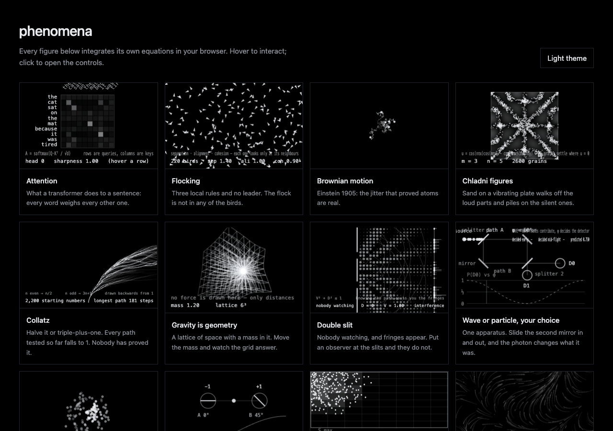

# BN Lab

**Física y matemática interactivas que calculan de verdad.**
Cuarenta simulaciones en vivo —caos, ondas, óptica, mecánica cuántica,
relatividad, mecánica estadística, autómatas, optimización— y un fluido de
Navier-Stokes en la GPU. Cada figura integra sus propias ecuaciones en el
navegador. Sin dependencias, 100 KB minificado con todas incluidas, y cada una
se puede importar por separado.

[Leer el artículo](https://www.bnsolutions.cl/research/bn-lab) ·
[Experimentos](docs/EXPERIMENTS.md) ·
[Resultados de validación](validation/RESULTS.md) ·
[Read in English](README.md)



## Por qué

La mayoría de las explicaciones interactivas son ilustraciones: una animación
dibujada para parecerse a la física. Acá la figura es el sistema corriendo. El
péndulo doble integra sus ecuaciones de Lagrange, el modelo de Ising corre
Monte Carlo de Metropolis y el fluido proyecta su campo de velocidad sobre uno
sin divergencia sesenta veces por segundo. Mover el cursor perturba un sistema
vivo.

Eso también las hace comprobables. Una [suite de validación](#validación) llama
a las mismas funciones que corren en pantalla y las compara con resultados
publicados.

## Empezar

### En una página, sin compilar nada

```html
<canvas id="sim" style="width:100%;height:480px"></canvas>
<div id="controles"></div>

<script src="https://cdn.jsdelivr.net/gh/4mser/bn-lab@v0.1.0/dist/bn-lab.min.js"></script>
<script>
  BNLab.mount(document.getElementById('sim'), 'lorenz', {
    controls: document.getElementById('controles'),
    locale: 'es'
  });
</script>
```

El paquete para navegador registra todos los experimentos, así que se montan
por id. `dist/bn-lab.css` da un estilo neutro a los deslizadores; también
puedes estilizar tú las clases `.bnlab-*`.

### Con un empaquetador

```sh
npm install github:4mser/bn-lab
```

```js
import { mount } from 'bn-lab';
import fluid from 'bn-lab/experiments/fluid';

const sim = mount(canvas, fluid, { theme: 'auto', accent: '#0a5cff', locale: 'es' });
```

Cada experimento es un módulo aparte: solo se incluyen los que importas.

## API

`mount(canvas, experimento, opciones)` arranca un experimento sobre un
`<canvas>`. Toma el tamaño de su caja CSS, sigue sus cambios de tamaño, dibuja
solo mientras está en pantalla y la pestaña está visible, y limita las
pantallas de alta frecuencia a 60 fps para que la física corra igual en todas.

| opción | por defecto | |
|---|---|---|
| `theme` | `'dark'` | `'dark'`, `'light'`, `'auto'` o `{ mode, accent, paper, ink, core }` |
| `accent` | el del tema | color principal: `'#0a5cff'`, `'rgb(10 92 255)'` o `[10, 92, 255]` |
| `controls` | — | elemento que recibe un deslizador por parámetro y un botón de reinicio |
| `locale` | `<html lang>` | `'en'` o `'es'` |
| `params` | defaults | valores iniciales, acotados a su rango |
| `pixelRatio` | `2` | tope para `devicePixelRatio` |
| `autoplay` | `true` | arrancar al ser visible |
| `motion` | `'auto'` | `'reduce'` dibuja una imagen fija; `'always'` ignora `prefers-reduced-motion` |
| `onError` | — | se llama si el experimento no puede arrancar |

Devuelve un objeto con `set(clave, valor)`, `get`, `reset()`, `resetParams()`,
`pause()`, `play()`, `step(n)`, `setTheme(tema)`, `destroy()` y `supported`.
Un lienzo que no puede correr su experimento recibe
`data-bnlab="unsupported"` y dispara el evento `bnlab:unsupported`.

La referencia completa, con los tipos, está en el [README en inglés](README.md#api)
y en [`types/index.d.ts`](types/index.d.ts).

## Escribir un experimento

Un experimento es un objeto plano: `make` construye el estado una vez y `step`
avanza y dibuja un cuadro. Hay un ejemplo completo en
[`examples/custom.html`](examples/custom.html) y las reglas de la casa en
[CONTRIBUTING](CONTRIBUTING.md): decir qué integrador se usa y por qué,
exportar la función de actualización cuando hay algo que validar, colores
siempre desde el tema, etiquetas en inglés y español, y fuentes primarias
citadas.

## El fluido

`fluid` resuelve las ecuaciones de Navier-Stokes incompresibles en la GPU con
el método de fluidos estables: advección semi-lagrangiana, proyección de
presión con iteraciones de Jacobi y confinamiento de vorticidad, cada etapa un
fragment shader sobre texturas de medio flotante. Corre en WebGL2 o WebGL1,
incluido iOS. En tema oscuro la tinta se suma como luz; en tema claro la misma
densidad se lee como pigmento, y el cambio de tema mezcla entre los dos sin
reiniciar. El solucionador está adaptado de
[WebGL-Fluid-Simulation](https://github.com/PavelDoGreat/WebGL-Fluid-Simulation)
de Pavel Dobryakov (MIT); ver [THIRD_PARTY_NOTICES](THIRD_PARTY_NOTICES.md).
Es un modelo bidimensional, sin viscosidad y numéricamente difusivo: sirve para
entender advección e incompresibilidad, no para calcular flujos de ingeniería.

## Validación

`npm run validate` usa las funciones exactas que corren en pantalla y las
compara con resultados publicados o exactos. Los criterios se fijan antes de
correr. Salida completa: [validation/RESULTS.md](validation/RESULTS.md).

| experimento | cantidad | en pantalla | referencia |
|---|---|---|---|
| Atractor de Lorenz | mayor exponente de Lyapunov | 0,9072 | 0,9056 (Sprott 2003) |
| Péndulo doble | error de energía, 60 s, sin amortiguación | < 0,001 % | 0 (hamiltoniano) |
| Órbitas de Kepler | deriva del momento angular · precesión del periapsis | 7e-14 · 0,38° por órbita | 0 · 0° |
| Modelo de Ising | ⟨\|m\|⟩ a T = 2,0, red de 64×64 | 0,9113 | 0,9113 (Onsager–Yang) |

## Experimentos

Cuarenta, cada uno con el modelo, cómo está implementado, qué mirar, por qué
importa y fuentes primarias, en inglés y español:
**[docs/EXPERIMENTS.md](docs/EXPERIMENTS.md)**.

## Citar

Si usas BN Lab en material docente, un artículo o una charla, revisa
[CITATION.cff](CITATION.cff).

## Licencia

MIT © 2026 [B&N Solutions](https://www.bnsolutions.cl), Santiago, Chile.
El solucionador de fluidos incluye código MIT de Pavel Dobryakov; ver
[THIRD_PARTY_NOTICES.md](THIRD_PARTY_NOTICES.md).
